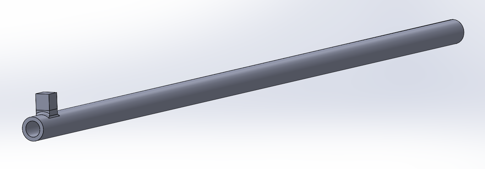
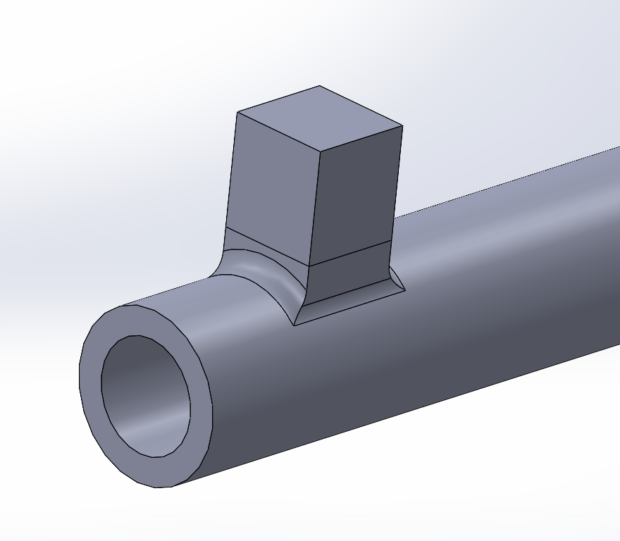
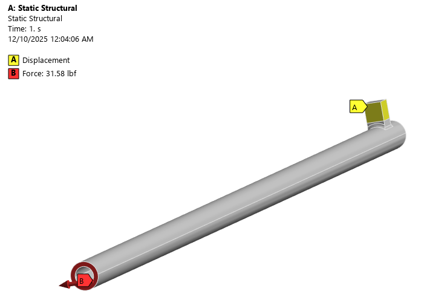
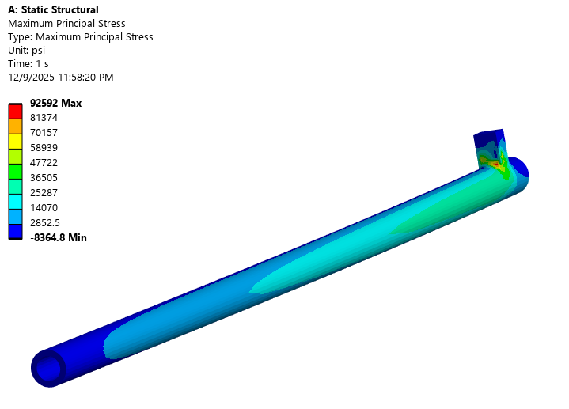
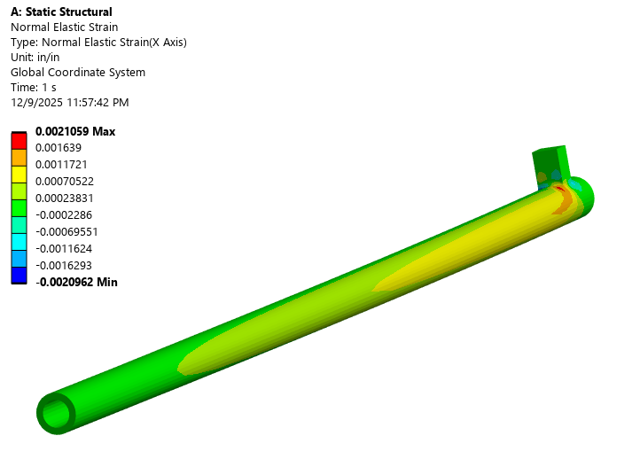
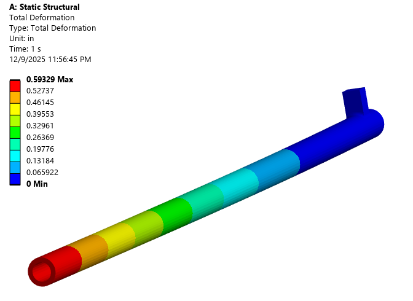

## Project Overview
For this project, I designed a torque wrench. I selected the torque wrench material, specified strain gauges, and defined the geometery of the torque wrench so that it could accurately measure torques in the range of 600 in-lbs. I then analyzed my design with FEA to ensure minimal deflection and safety requirements were met.

## Torque Wrench CAD

Length: 18"

Outer Diameter: 0.6"

Inner Diameter: 0.4"

Drive Profile Dimensions: 3/8" x 3/8"

## Material Selection
The material I chose for this torque wrench is 301 full hard stainless steel. I chose this material for its high yield and fatigue strength, and its corrosion resistance.

Yield Strength: 129 ksi  
Tensile Strength: 170 ksi  
Fatigue Strength at 10^7 Cycles: 76.1 ksi

Poisson's Ratio: 0.28  
Young's Modulus: 28 Msi  
Density: 0.285 lb/in^3

## Loads and Boundary Conditions

I wanted to analyze my torque wrench to 600 in-lbf, so I set up my FEA loads and boundary conditions accordingly. The force I applied was 31.58 lbf, enough to cause a 600 in-lbf at the drive profile when scoped to the end of the torque wrench. The boundary conditions on the drive profile are clamped, modelled as a zero displacement boundary condition in ANSYS.

## Results

Max Normal Stress: 70.4 ksi  
Load Point Defleciton: 0.593"  
X-axis Strain at Strain Gauge Location: 1204 microstrain

## Strain Gauge Selection

Torque Wrench Sensitivity: 1.19 mV / V

Strain Gauge Selected: Half bridge strain gauge with a strain gauge factor of 2 and dimensions of 1" x 0.5"

